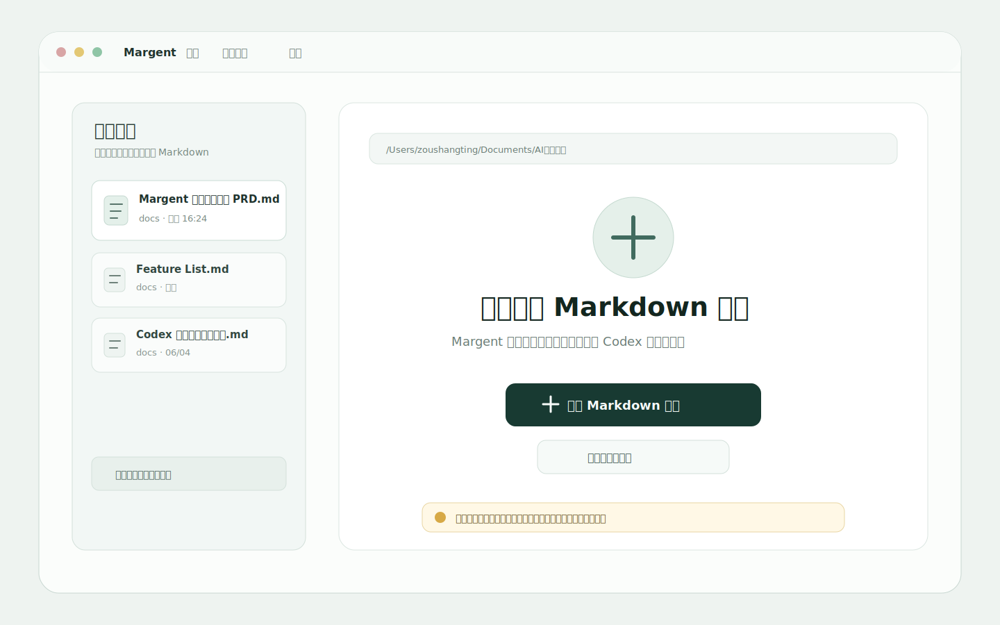
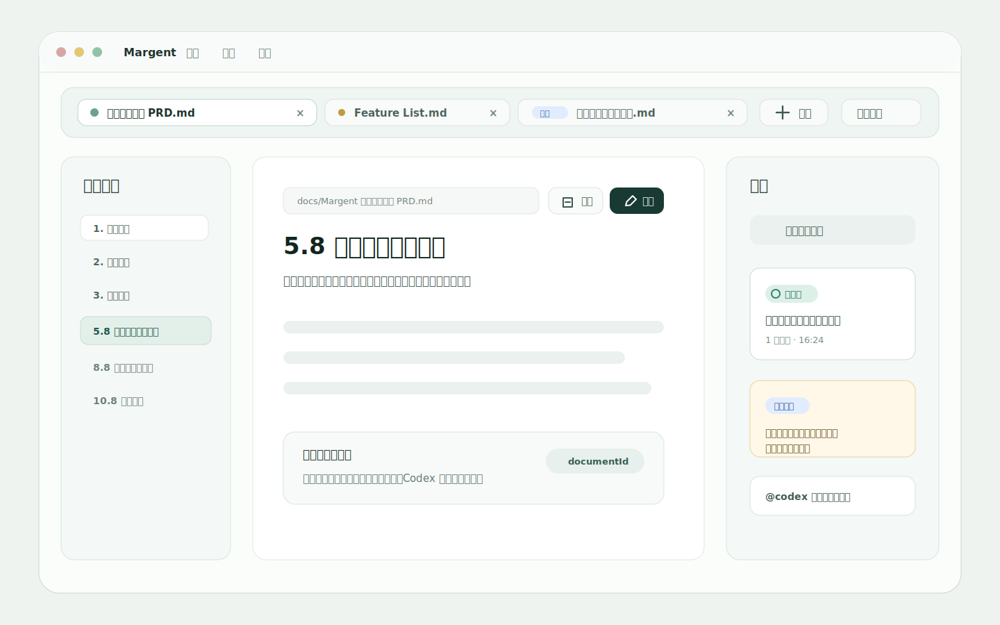

# Margent 基础体验增强 PRD

## 1. 文档信息

- 产品名称：Margent
- 模块名称：基础体验增强
- 文档日期：2026-06-05
- 目标版本：v0.4.0
- 当前状态：需求草案
- 对应 Feature List：`Margent 多语言配色与空态启动页 Feature List.md`

## 2. 模块目标

本模块在已有阅读、批注、编辑、MCP / Codex 协作闭环之上，补齐 Margent 作为本机 Markdown App 的基础体验。

目标体验：

> 用户把 Margent 当作本机 Markdown 审阅器使用时，可以用熟悉的语言、舒适的配色、清晰的启动页和原生 macOS 菜单完成日常操作；当文档被用户或 Codex 修改后，历史批注能尽量跟随内容变化，不因为 block 编号漂移而跳到不相关位置。

本模块不改变 Margent 的核心定位：本地优先、轻量、面向 AI 协作的 Markdown 阅读与审阅工具。

## 3. 用户价值

- 新用户打开 App 时能立刻知道如何打开文档，不再看到空白或工程化状态。
- 中文和英文用户都能理解主要界面操作，降低分发给他人使用时的门槛。
- 长时间阅读 Markdown、Mermaid、表格和批注时，用户可以选择更适合自己的配色方案。
- App 级操作收敛到 macOS 原生菜单栏，文档内操作区只保留当前文档相关的高频动作。
- 批注文档被修改后，历史批注仍然能尽量定位到相关内容，减少审阅上下文丢失。
- 当用户打开一份 Codex 产出的 Markdown 但缺少 `.codex.json` 时，Margent 可以在用户授权后从本机 Codex 日志中自动发现来源会话，减少手动绑定成本。
- 当前文档被外部编辑器或 Codex 改动后，Margent 能自动检测并刷新内容，不需要用户手动重新打开文档。
- 用户可以同时打开多份 Markdown 文档，在同一个 App 中快速切换，不需要反复通过 Finder 重新打开。

## 4. 核心概念

### 4.1 App 级设置

App 级设置是跨文档生效的偏好项，包括语言、配色方案、启动行为、最近文件管理和 MCP / Codex 连接展示信息。

App 级设置从 macOS 原生菜单栏进入，不在阅读态、编辑态、空态分别重复放置设置入口。

### 4.2 文档内操作区

文档内操作区只承载当前文档上下文相关操作，包括当前文档路径 / 文件名、阅读 / 编辑状态、保存 / 退出编辑、批注入口、Codex 连接和自动监控状态。

文档内操作区不承载低频解释文本。状态解释进入 tooltip、toast 或设置面板。

### 4.3 配色方案

配色方案是完整 UI token 组合，不是单个背景色。切换配色时需要影响页面、正文、目录、批注、按钮、表格、代码块、Mermaid 和交互状态。

### 4.4 空态启动页

空态启动页是没有打开任何 Markdown 文件时的默认页面。它只提供必要入口和轻量状态，不做营销页。

### 4.5 批注锚点

批注锚点是批注和正文位置之间的连接信息。锚点恢复的核心依据是用户当时选中的文本和上下文，而不是 `blockId` / `blockIndex`。当前 block 编号会随 Markdown 结构变化而漂移，因此只能作为弱提示，用于辅助排序和更新，不能作为第一定位依据。

批注锚点需要区分：

- `originalSelectedText`：用户最初选中的文本，用于保留批注的原始审阅意图。
- `selectedText`：当前用于定位的文本。正文被 Codex 或用户明确改写后，它可以更新为修改后的新文本。
- `prefix` / `suffix`：选中文本前后的上下文，用于在多处文本命中时消歧。

### 4.6 Block Fingerprint

Block fingerprint 是用于辅助恢复批注位置的内容特征。它不是主锚点，而是文本定位后的排序信号。创建批注或保存文档时，系统应尽量记录与该 block 相关的稳定信息，例如：

- block 类型
- block 原文摘要或 hash
- 所属标题
- 前一个 / 后一个 block 的摘要
- 批注选中文本
- 批注选中文本前后的 prefix / suffix
- block 在原文中的 markdownOffset 或相对位置

Fingerprint 不作为用户可见信息，只用于文档变化后的锚点恢复。

### 4.7 Codex 来源自动发现

Codex 来源自动发现是指：当 Markdown 文件没有 `.codex.json` 连接信息时，Margent 在用户授权后读取本机 Codex session 日志，通过文件路径、文档名和最近工具调用记录，推断最可能的来源 Codex 会话。

该能力是本机 best-effort 增强，不是 Codex 官方稳定 thread provenance API。它只用于降低手动绑定成本，不能替代 `.codex.json` 作为正式连接记录。

### 4.8 外部文件变更自动刷新

外部文件变更自动刷新是指：当前打开的 Markdown 文件在 Margent 之外被修改后，App 自动检测磁盘文件变化，并在合适时机重新加载正文、目录、批注和 Codex 连接状态。

自动刷新不能打断用户当前操作。用户正在编辑正文、选择文字、写批注或回复时，系统需要延迟刷新，并在操作结束后应用更新。

### 4.9 多文档工作区

多文档工作区是指 Margent 在一个 App 会话中同时持有多份已打开 Markdown 文档，并允许用户在文档之间切换。

每份文档拥有独立的阅读位置、目录状态、批注列表、编辑草稿、外部刷新状态和 Codex 连接状态。切换文档不应丢失另一份文档的当前状态。

## 5. 功能范围

### 5.1 P0：多语言支持，中文 / 英文

#### 5.1.1 默认语言

- 首次启动默认跟随系统语言。
- 系统语言为中文时，默认中文。
- 其他语言环境下，默认英文。

#### 5.1.2 手动切换

- 用户可以在 App 设置面板中切换中文 / 英文。
- 语言设置需要持久化。
- 下次启动保持用户选择。

#### 5.1.3 文案覆盖范围

P0 需要覆盖主要产品界面文案：

- 空态启动页
- 文档内操作区
- 目录栏
- 批注列表
- 批注创建 / 回复 / 编辑 / 删除 / 状态操作
- 编辑态保存 / 退出
- Mermaid 工具按钮与 toast
- 文件打开、加载、错误状态
- macOS 原生菜单栏中的 App 级菜单项

不翻译用户打开的 Markdown 正文内容。

### 5.2 P0：配色方案，默认 / 蓝白 / 灰白

#### 5.2.1 配色方案

- 保留当前默认配色。
- 新增蓝白配色：偏清爽、理性、文档工具感。
- 新增灰白配色：偏中性、低干扰、长时间阅读友好。

#### 5.2.2 切换入口

- 用户可以在 App 设置面板中切换配色方案。
- 配色选择需要持久化。
- 下次启动保持用户选择。

#### 5.2.3 Token 覆盖范围

配色切换需要影响完整 UI：

- 页面背景
- 正文区域
- 目录栏
- 批注列表
- 按钮、输入框、分段控件
- toast
- 表格
- 代码块
- Mermaid 容器与工具栏
- 选区、批注高亮、hover / active / disabled 状态

### 5.3 P0：空态启动页

#### 5.3.1 页面出现时机

- App 启动且没有打开任何文档时，展示空态启动页。
- 当前文档关闭或加载失败后，也可以回到空态启动页。

#### 5.3.2 页面内容

空态启动页保持简洁，不做营销页，不出现大段产品介绍。

P0 核心入口：

- 打开 Markdown 文件
- 查看最近打开文件

最近打开文件展示：

- 文件名
- 文件路径
- 最近打开时间
- 文件不存在时的轻量状态

#### 5.3.3 错误处理

- 文件打开失败时，在启动页内显示可读错误提示。
- 用户可以重新选择文件。
- 最近文件不存在时，不阻断其他文件打开流程。

### 5.4 P0：macOS 菜单栏与文档内操作区

#### 5.4.1 macOS 原生菜单栏

App 级命令优先放在 macOS 原生菜单栏中，不在页面内自建重复的 App 顶部栏。

P0 菜单项至少包含：

- 打开 Markdown 文件
- 最近打开文件
- App 设置
- 退出 App

需要显式配置 macOS 原生菜单项和文案，不继续暴露 Tauri / WebView 默认菜单中的无关项。

#### 5.4.2 统一 App 设置面板

App 设置面板从 macOS 菜单栏进入。

P0 设置项包括：

- 语言
- 配色方案
- 启动行为
- 最近文件管理，且需要跨 CLI 和桌面 App 共享
- 当前文档连接状态，包括 Codex 来源会话和自动监控开关

阅读态、编辑态、空态都复用同一套 App 设置面板。

当前文档设置分组的边界：

- P0 只放 Codex 连接、自动监控、来源自动发现状态等协作相关设置。
- “阅读偏好”指目录默认展开 / 收起、批注列表默认打开状态、阅读位置恢复、正文行宽等阅读体验项。
- “展示偏好”指 Mermaid 默认背景、Mermaid 默认显示图片或源码、表格列宽、代码块折行等内容展示项。
- 阅读偏好和展示偏好暂不进入 P0 设置面板，后续作为 P1 再评估，避免设置入口过早变重。

#### 5.4.3 文档内操作区

文档内只保留当前文档上下文相关的高频操作：

- 当前文档路径 / 文件名
- 编辑 / 保存 / 退出编辑
- 批注列表入口
- 当前文档的 Codex 连接和自动监控状态

### 5.5 P0：批注锚点稳定性

#### 5.5.1 锚点恢复原则

批注定位和修复从 `blockId-first` 调整为 `text-first`。

系统恢复批注位置时，优先级如下：

1. 优先在原 `heading` 范围内匹配 `selectedText`。
2. 如果同一标题范围内有多个命中，使用 `prefix` / `suffix`、block 类型、旧 `blockIndex` 距离、旧 `markdownOffset` 距离进行打分。
3. 如果原标题范围内没有命中，再在全文匹配 `selectedText`。
4. 如果 `selectedText` 找不到，再使用 `prefix` / `suffix` 做上下文匹配。
5. 如果文本和上下文都无法高置信定位，再使用 `blockId` / `blockIndex` 作为弱提示；但必须验证该 block 与原批注文本或上下文相似，不能因为旧 `blockId` 仍然存在就直接命中。
6. 如果仍不可靠，降级到可信标题，并把批注标记为位置不精确。

系统需要避免错误定位优先于避免降级。低置信时宁可挂到标题并提示“位置可能已变化”，也不能把批注高亮到不相关 block。

#### 5.5.2 保存后回扫历史批注

每次 Markdown 通过 Margent 编辑保存或 MCP / Codex 写回时，系统需要：

1. 解析保存前 Markdown blocks。
2. 解析保存后 Markdown blocks。
3. 建立文本候选索引和 old block -> new block 弱映射。
4. 回扫当前文档的全部历史批注。
5. 对每条批注优先按 `selectedText`、`prefix` / `suffix` 和 heading 重新定位。
6. 更新批注锚点中的 `selectedText`、`blockId`、`blockIndex`、`headingId`、`headingText`、`startOffset`、`endOffset`、`prefix` 和 `suffix`。

系统不能只更新当前被处理的批注。一次正文修改可能影响多条历史批注的 block 位置。

#### 5.5.3 多文本命中与置信度

当 `selectedText` 在文档中出现多次时，系统不能只取第一个 `indexOf` 结果，需要生成候选并打分。

候选打分信号包括：

- heading id 或 heading 文本一致。
- `selectedText` 完全匹配优先于规范化匹配。
- `prefix` / `suffix` 与候选位置两侧文本相似。
- block 类型一致，例如原来是 list-item 就优先 list-item。
- 候选位置距离旧 `blockIndex` 或旧 `markdownOffset` 更近。
- old block -> new block 映射结果支持该候选。

如果第一候选和第二候选分数差距足够大，系统可以自动更新锚点。如果多个候选置信度接近，系统需要降级到标题级定位，不强行选择其中一个。

#### 5.5.4 Block 映射策略

block 映射仍然需要保留，但定位优先级低于文本与上下文。它主要用于辅助以下场景：

- 文档前部新增或删除内容，导致旧 `block-95` 变成新 `block-94`。
- 某个 block 内的选中文本被小幅改写，`selectedText` 无法完全匹配。
- block 被移动、拆分或合并，需要为文本候选提供额外排序信号。

block 映射按以下优先级执行：

1. 内容完全相同的 block 直接映射。
2. 同一标题范围内、类型一致、文本相似度高的 block 优先映射。
3. 标题重命名但位置连续时，识别为同一章节 block 的演进。
4. 通过编辑前后 diff 将旧 block 的字符区间映射到新文档区间。
5. 使用 block fingerprint 进行辅助匹配。

典型场景：

- `3.4 应用顶部栏与统一设置入口` 被改为 `3.4 macOS 菜单栏与文档内操作区`，系统应识别为同一章节演进，并把历史批注迁移到新标题或新章节 block。
- 文档前面新增 `3.5` 相关说明导致旧 `block-95` 漂移时，系统应优先基于批注文本和上下文重新定位，再使用 old-new block 映射更新批注中的新 `blockId`，而不是继续相信旧 `blockId`。
- 如果用户批注的原文本被 Codex 改写，系统应优先通过上下文和 block 映射定位到改写后的新文本，并更新 `selectedText`；同时保留 `originalSelectedText`。

#### 5.5.5 `selectedText` 更新策略

`selectedText` 是当前定位文本，可以在明确文本演进时更新。

允许更新 `selectedText` 的情况：

- Codex 通过 `reviewer_apply_document_edit` 处理某条批注，并传入 `preferredSelectedText`。
- 文档修改前后的上下文高度一致，只是选中文本发生小幅改写。
- block 拆分或合并后，系统能通过 prefix / suffix 高置信定位到新的对应文本。

不允许更新 `originalSelectedText`。它需要保留用户最初批注的原始引用，便于后续人工判断和审计。

如果系统无法判断新文本是否仍然对应原批注，不更新 `selectedText`，只降级到标题或标记为位置不精确。

#### 5.5.6 外部文件改动

外部文件改动分三种情况处理：

- 如果 Margent 正打开该文档，内存中仍有旧正文，文件变化后使用旧正文和新磁盘正文执行文本优先修复，并用 old block -> new block 映射辅助更新。
- 如果 Margent 关闭期间文档被外部修改，重新打开时无法直接知道旧 `block-95` 变成了哪个新 block，需要依赖 `.review.json` 中保存的 `selectedText`、`originalSelectedText`、`prefix`、`suffix`、heading 和 block fingerprint 做恢复。
- 如果无法可靠恢复，不继续相信旧 `blockId`，而是降级到可信标题或标记为位置不精确。

#### 5.5.7 前端定位保护

前端定位批注时，不能只因为旧 `blockId` 在当前页面中存在就直接定位。

定位前需要校验：

- `selectedText` 或 `originalSelectedText` 是否能在当前文档中找到可靠候选。
- prefix / suffix 或上下文是否匹配候选位置。
- heading 是否仍可信。
- blockId 指向的当前 block 是否与原批注文本或上下文相似。
- anchor 是否已经被标记为不精确。

如果校验失败，前端需要走文本匹配、标题 fallback 或“不精确位置”提示，避免跳到不相关内容。前端定位可以临时恢复显示位置，但高置信修复结果需要由服务端写回 `.review.json`，避免每次打开都重复漂移。

#### 5.5.8 不精确位置

当系统无法精确恢复批注时：

- 不删除批注。
- 不自动改变批注状态。
- 批注挂到原上一级标题或最可信章节。
- UI 只在批注卡片上提示“位置可能已变化”。
- 正文高亮不额外展示不精确提示，避免干扰阅读；如果具体文本无法恢复，正文侧可以降级到章节或 block 级定位。

### 5.6 P0.5：Codex 来源自动发现

#### 5.6.1 触发条件

当用户打开 Markdown 文件时，如果该文档没有对应 `.codex.json`，Margent 可以尝试进行来源自动发现。

自动发现可以在本机运行环境中直接尝试高置信匹配。首次使用时，App 设置中需要说明：

- Margent 会读取本机 Codex session 日志。
- 读取目的仅用于查找该 Markdown 文件可能来自哪个 Codex 会话。
- 高置信匹配成功后会直接在文档旁边写入 `.codex.json`，不再弹出二次确认。
- 用户可以关闭该能力，关闭后仍可通过接续指令手动绑定。

#### 5.6.2 匹配信号

Margent 可以使用以下本机信号进行匹配：

- Codex session 文件中出现完整 Markdown 绝对路径。
- Codex session 文件中出现 Markdown 文件名。
- Codex 工具调用记录中出现对该文件的创建、编辑、读取或打开。
- session 所属 workspace 与当前文档所在 workspace 一致。
- session 更新时间接近该 Markdown 文件的创建或修改时间。

#### 5.6.3 置信度策略

只有高置信候选才自动绑定。

高置信示例：

- 最近 Codex session 中只有一个会话出现该文档完整路径。
- 该会话的 thread id 可以从 session 文件名或 session 元数据中提取。
- 该会话的更新时间接近文件创建或修改时间。

低置信示例：

- 多个会话都出现过该文件路径。
- 只匹配到文件名，没有匹配到完整路径。
- 只匹配到同 workspace，没有具体文件记录。
- session 日志格式无法解析或 thread id 无法提取。

低置信时不自动绑定，UI 继续展示未连接状态，并提供手动接续指令。第一版不需要把候选详情暴露给用户。

#### 5.6.4 写入结果

高置信匹配成功后，Margent 写入同名 `.codex.json`：

- `source.threadId` 使用匹配到的 Codex thread id。
- `target.threadId` 默认等于 source thread id。
- `target.type` 默认为 `source`。
- `connection.status` 显示已关联来源会话。
- `configuredVia` 标记为 `local-log-discovery`。

后续自动监控和 `@codex` 投递都基于该 `.codex.json` 工作。

#### 5.6.5 隐私与控制

- 该能力可以默认尝试最近 session 的高置信匹配，但不应静默扫描全部历史日志。
- 用户可以在设置中关闭“读取本机 Codex 日志以自动关联来源会话”。
- 扫描范围限制在最近 session 和当前 workspace 相关日志。
- 不上传日志内容。
- 不把 session 日志正文写入 `.codex.json` 或 `.review.json`。
- 如果用户关闭该能力，Margent 不再主动读取 Codex session 日志。

### 5.7 P0：外部文件变更自动刷新

#### 5.7.1 监听范围

当 Margent 打开一份 Markdown 文档时，需要监听以下文件变化：

- 当前 Markdown 文件。
- 同名 `.review.json`。
- 同名 `.codex.json`。

任一文件发生变化时，Margent 需要判断是否刷新对应数据。

#### 5.7.2 自动刷新内容

外部变化触发后，系统需要刷新：

- Markdown 正文内容。
- 文档目录。
- Mermaid、代码块、表格等渲染结果。
- 批注列表和批注高亮。
- Codex 连接状态。

刷新后需要尽量保持用户当前阅读位置。如果无法保持精确位置，优先保持当前标题或相近滚动位置。

#### 5.7.3 延迟刷新

以下状态下不立即刷新正文：

- 用户处于编辑态且存在未保存修改。
- 用户正在选择文字。
- 用户正在填写批注弹窗。
- 用户正在回复或编辑批注。
- 用户正在操作 Mermaid 大图、表格列宽等局部交互。

当用户结束上述操作后，如果存在待应用的外部更新，系统再执行刷新。

批注列表和 Codex 连接状态可以更轻量地刷新，但不应导致整个文档区域闪烁或重建。

如果用户处于编辑态且有未保存草稿，外部正文更新进入 pending 状态，不覆盖草稿，也不自动合并。

#### 5.7.4 外部正文变化后的锚点修复

如果 Markdown 正文发生外部变化，Margent 需要触发批注锚点修复：

- 如果内存中仍有旧正文，使用旧正文和新正文执行文本优先锚点修复，并建立 old block -> new block 映射作为辅助信号。
- 如果没有旧正文，使用 `.review.json` 中的 `selectedText`、`originalSelectedText`、`prefix`、`suffix`、heading 和 block fingerprint 尝试恢复。
- 修复后写回 `.review.json`。
- 无法精确恢复的批注标记为位置不精确。

#### 5.7.5 用户提示

自动刷新成功时，不需要常驻提示，避免干扰阅读。

当刷新被延迟时，可以在文档内操作区使用轻量状态提示：

- “文档有外部更新”
- “完成当前操作后刷新”

当用户存在未保存编辑草稿且外部文件也发生变化时，需要提示冲突，不自动覆盖用户草稿。

冲突处理需要提供明确选择：

- 保留当前草稿，继续编辑。
- 放弃当前草稿，载入外部最新版本。
- 先保存当前草稿；如果磁盘版本已经变化，保存时进入冲突提示，不直接覆盖外部版本。

P0 不做自动三方合并，也不做复杂 diff 预览。

### 5.8 P0：同时打开多个文档

#### 5.8.1 打开方式

用户可以在已有文档打开的情况下继续打开其他 Markdown 文件。

入口包括：

- macOS 菜单栏：打开 Markdown 文件。
- 空态启动页：打开 Markdown 文件。
- 最近打开文件列表。
- 文件被系统默认打开方式唤起时，如果 Margent 已运行，则加入当前 App 会话。

打开新文件时，不替换当前文档，而是新增为一个已打开文档。

#### 5.8.2 文档切换

P0 使用轻量文档切换控件，不做复杂项目树。

切换控件需要展示：

- 文件名。
- 当前打开状态。
- 未保存状态。
- 外部更新状态。

用户切换文档后，主阅读区、目录栏、批注列表、Codex 连接状态都切换到对应文档。

#### 5.8.3 独立文档状态

每份打开的文档需要独立保存当前会话内状态：

- 阅读滚动位置。
- 目录展开 / 收起状态。
- 批注列表打开 / 收起状态。
- 当前批注筛选条件。
- 编辑态 / 阅读态。
- 未保存编辑草稿。
- Mermaid 大图状态。
- 外部刷新 pending 状态。
- Codex 连接状态。

切换到另一份文档时，不能丢失当前文档的未保存草稿。

#### 5.8.4 关闭文档

用户可以关闭某一份已打开文档。

关闭前需要判断：

- 是否存在未保存编辑草稿。
- 是否存在外部更新冲突。

如果存在风险，用户需要确认保存、放弃或取消关闭。

关闭当前文档后，系统切换到最近使用的另一份已打开文档；如果没有其他文档，则回到空态启动页。

#### 5.8.5 多文档与 Codex 连接

每份文档独立读取自己的 `.codex.json`。

批注自动监控、`@codex` 投递和来源自动发现都以当前文档为单位工作，不共享到其他文档。

当多份文档都开启自动监控时，投递仍需要按文档维度串行，避免多个 Codex turn 同时修改同一份 Markdown。

#### 5.8.6 多文档与外部刷新

每份已打开文档都需要监听自己的 `.md`、`.review.json` 和 `.codex.json`。

非当前激活文档发生外部变化时，可以静默记录更新状态，不强行切换用户当前视图。

当用户切换回该文档时，如果没有未保存草稿，则自动应用刷新；如果存在未保存草稿，则提示冲突。

## 6. P1 功能

### 6.1 多语言增强

- 根据语言切换时间、日期、数量等格式化展示。
- 对 MCP / Codex 连接相关提示补齐英文文案。
- 建立文案 key 命名规范，避免后续文案散落在组件中。

### 6.2 配色增强

- 支持跟随系统浅色 / 深色模式，但不作为独立的用户可见配色状态。
- 为 Mermaid lightbox、代码编辑器、表格列宽调整等复杂组件补齐不同配色状态。
- 建立配色 token 表。

### 6.3 空态增强

- 支持将 Markdown 文件拖入启动页打开。
- 支持展示当前 Codex / MCP 连接状态，但不抢占主操作。
- 支持从启动页恢复上次关闭前的文档。
- 支持清理最近文件记录。
- 不提供“打开示例文档”入口，避免空态变成教学或营销页面。

### 6.4 macOS 菜单栏增强

- 支持快捷键：
  - 打开文件：Cmd+O
  - 打开设置：Cmd+,
  - 保存：Cmd+S，仅编辑态可用
- 支持 macOS 菜单栏根据当前状态启用 / 禁用菜单项。
- 支持最近打开文件作为 macOS 菜单栏子菜单。
- 支持在设置面板内查看当前 App 版本、MCP 连接状态、默认 Markdown 打开方式状态。

### 6.5 批注锚点增强

- 为 anchor repair 建立最小单元测试。
- 覆盖文本唯一命中、文本多处命中、标题重命名、段落新增、段落移动、block 删除、block 拆分和 block 合并。
- 为候选位置 scoring 建立可解释的测试样例，确保 `blockId` 不再作为第一定位依据。
- 在批注卡片展示轻量状态，提示“位置可能已变化”。
- 对 Agent 修改型批注，MCP 工具继续支持 `preferredSelectedText`，并把关联批注优先锚定到修改后的目标文本。

### 6.6 Codex 来源自动发现增强

- 支持在设置面板中查看最近一次自动发现结果。
- 支持对自动发现失败原因给出轻量说明，例如“未找到文件路径记录”或“找到多个候选”。
- 如果未来 Codex 提供稳定本机 provenance API，则优先使用官方 API，日志扫描降级为兼容路径。

### 6.7 外部文件变更自动刷新增强

- 支持在设置中关闭自动刷新，只保留手动刷新。
- 支持显示最近一次外部刷新时间。
- 支持用户点击状态提示立即刷新。
- 支持对外部修改导致的锚点不精确数量进行轻量提示。

### 6.8 多文档增强

- 支持拖拽多个 Markdown 文件到 App 后批量打开。
- 支持恢复上次关闭前打开的多个文档。
- 支持最近文档分组展示已打开 / 未打开状态。
- 支持在多文档切换控件中搜索文件名。
- 支持把某份文档拖出为独立窗口。

## 7. 不支持范围

本模块暂不做：

- 机器翻译 Markdown 正文内容。
- 除中文、英文之外的第三语言。
- 用户自定义色值或主题市场。
- 每个文档单独保存配色。
- 文档模板库。
- 云端文件入口。
- 账户系统。
- 团队协作入口。
- 多级页面导航。
- 将文档内编辑工具全部搬进 macOS 菜单栏。
- 空态启动页中的“打开示例文档”入口。
- 语义级向量匹配。
- 大段重写后的自动语义恢复。
- 多人同时编辑下的复杂冲突合并。
- 无授权读取全部 Codex 历史会话。
- 将 Codex session 日志内容同步到云端。
- 自动合并用户未保存草稿和外部文件修改。
- 项目级文件树。
- 多文档跨文件搜索。
- 多文档批量替换。
- 多文档之间的批注聚合面板。

## 8. 核心流程

### 8.1 首次启动流程

1. 用户启动 Margent。
2. 系统检测是否有待打开文档。
3. 如果没有文档，展示空态启动页。
4. 系统根据系统语言选择默认界面语言。
5. 系统加载默认配色方案。
6. 用户点击打开 Markdown 文件。
7. 系统打开 Finder 并加载用户选择的 `.md` 文件。

### 8.2 设置语言 / 配色流程

1. 用户从 macOS 菜单栏打开 App 设置。
2. 用户修改语言或配色方案。
3. 系统立即更新当前界面。
4. 系统持久化设置。
5. 用户下次启动 App 时继续使用该设置。

### 8.3 App 级打开文件流程

1. 用户从 macOS 菜单栏点击打开 Markdown 文件。
2. 系统打开 Finder。
3. 用户选择 `.md` 文件。
4. 系统加载文档正文、目录、批注和 Codex 连接状态。
5. 文件路径进入最近打开文件记录。

### 8.4 通过 Margent 保存后的批注修复流程

1. 用户或 Codex 修改 Markdown 正文。
2. 系统保存前保留旧 Markdown 内容和旧 blocks。
3. 系统写回新 Markdown。
4. 系统解析新 Markdown blocks。
5. 系统建立文本候选索引和 old block -> new block 弱映射。
6. 系统回扫全部历史批注，优先按 `selectedText`、`originalSelectedText`、prefix / suffix 和 heading 定位。
7. 多处命中时，系统按上下文、block 类型、旧位置距离和 block 映射结果评分。
8. 系统更新可高置信恢复的批注锚点。
9. 系统刷新文档和批注展示。
10. 如果某些批注无法精确恢复，UI 显示位置可能已变化。

### 8.5 外部修改后的批注修复流程

1. 用户在外部编辑器或 Codex 之外修改 Markdown 文件。
2. Margent 发现磁盘文件变化。
3. 如果内存中有旧正文，系统用旧正文和新正文执行文本优先修复，并用 block 映射辅助排序。
4. 如果没有旧正文，系统使用 `.review.json` 中的 `selectedText`、`originalSelectedText`、prefix、suffix、heading 和 block fingerprint 尝试恢复。
5. 系统更新可恢复的批注锚点。
6. 无法可靠恢复的批注降级到可信标题，并提示位置可能已变化。

### 8.6 Codex 来源自动发现流程

1. 用户打开一份没有 `.codex.json` 的 Markdown 文档。
2. Margent 检查用户是否已授权读取本机 Codex session 日志。
3. 如果未授权，Margent 展示未连接状态和手动接续指令，不自动扫描。
4. 如果已授权，Margent 扫描最近 Codex session 日志。
5. 系统按完整路径、文件名、工具调用记录、workspace 和时间接近度计算候选来源会话。
6. 如果只有一个高置信候选，Margent 写入 `.codex.json` 并显示已关联来源会话。
7. 如果没有候选或多个低置信候选，Margent 不自动绑定，保留手动绑定入口。

### 8.7 外部文件变更自动刷新流程

1. 用户打开 Markdown 文档。
2. Margent 监听当前 `.md`、`.review.json` 和 `.codex.json`。
3. 外部工具修改当前 Markdown 文件。
4. Margent 检测到磁盘文件变化。
5. 系统判断用户是否正在编辑、选择、写批注或进行局部交互。
6. 如果用户空闲，系统重新加载文档并执行锚点修复。
7. 如果用户忙碌，系统记录 pending refresh，并展示轻量状态。
8. 用户结束当前操作后，系统应用 pending refresh。
9. 如果存在未保存编辑草稿，系统提示冲突，不自动覆盖草稿。

### 8.8 多文档打开与切换流程

1. 用户已经打开文档 A。
2. 用户通过 macOS 菜单栏或最近文件打开文档 B。
3. Margent 将文档 B 加入已打开文档列表。
4. 系统加载文档 B 的正文、目录、批注和 Codex 连接状态。
5. 用户在切换控件中从文档 B 切回文档 A。
6. Margent 恢复文档 A 的阅读位置、批注列表状态和编辑草稿状态。
7. 如果文档 A 在后台发生外部更新，系统在切换回来时按自动刷新规则处理。

### 8.9 多文档关闭流程

1. 用户点击关闭某份已打开文档。
2. 系统检查该文档是否存在未保存草稿或外部更新冲突。
3. 如果没有风险，直接关闭。
4. 如果有未保存草稿，提示保存、放弃或取消。
5. 关闭后切换到最近使用的另一份文档。
6. 如果没有其他文档，回到空态启动页。

## 9. 数据与持久化

### 9.1 App 设置

需要持久化：

- 当前语言
- 当前配色方案
- 最近打开文件列表，跨 CLI 和桌面 App 共享
- 当前会话已打开文档列表
- 启动行为偏好
- Codex 来源自动发现开关
- 是否开启外部文件变更自动刷新

具体落点可以沿用现有桌面端配置机制，优先保持本地文件存储。

### 9.2 批注锚点数据

现有 `.review.json` 需要在 anchor 中补充或兼容以下字段：

- `originalSelectedText`
- `markdownOffset`
- `blockFingerprint`
- `anchorPrecision`
- `lastRepairedAt`
- `repairReason`
- `repairConfidence`

其中 `anchorPrecision` 可选值建议为：

- `exact`
- `text`
- `block`
- `heading`
- `unknown`

P0 可以先内部使用，不一定全部展示给用户。

字段含义：

- `originalSelectedText` 保留用户最初选中的文本，不随正文修改覆盖。
- `selectedText` 表示当前用于定位的文本，可以在高置信文本演进时更新。
- `markdownOffset` 表示创建或上次修复时的 Markdown 字符位置，只作为候选评分信号。
- `blockFingerprint` 用于 block 映射和多候选消歧，不作为主定位依据。

### 9.3 Codex Link

`.codex.json` 需要兼容自动发现写入来源：

- `configuredVia` 增加 `local-log-discovery`。
- 可选记录 `discoveredAt`。
- 可选记录 `discoveryConfidence`，例如 `high`。

不记录 session 日志正文，不记录用户对话内容。

## 10. 验收标准

### 10.1 多语言

- 首次启动能根据系统语言选择中文或英文。
- 用户能在设置中手动切换语言。
- 重启后语言选择保持不变。
- 主要 UI 不再混用未处理的旧语言文案。

### 10.2 配色

- 用户能在默认、蓝白、灰白之间切换。
- 切换后正文、目录、批注、按钮、表格、代码块和 Mermaid 工具栏都跟随变化。
- 重启后配色保持不变。

### 10.3 空态启动页

- 无文档启动时展示空态启动页。
- 用户能从启动页打开 Markdown 文件。
- 最近文件能展示并打开。
- 文件不存在或打开失败时有可读提示。

### 10.4 macOS 菜单栏

- macOS 菜单栏不再暴露明显无关的默认菜单项。
- 用户能从 macOS 菜单栏打开文件和 App 设置。
- 文档内操作区不再承载重复的 App 级入口。

### 10.5 批注锚点稳定性

- 在文档前部新增内容后，已有批注不会因为旧 `blockId` 漂移跳到不相关位置。
- 当前页面中存在旧 `blockId` 时，如果该 block 文本和原批注不匹配，系统不会直接定位到该 block。
- 当 `selectedText` 在同一文档中出现多次时，系统能使用 heading、prefix / suffix 和 block fingerprint 选择高置信候选；无法消歧时降级到标题。
- Codex 明确改写批注对应文本后，系统能在保留 `originalSelectedText` 的同时，把 `selectedText` 更新为修改后的新文本。
- 标题重命名后，原标题上的历史批注能迁移到新标题或新章节 block。
- Codex 修改某条批注对应正文时，其他历史批注也会一起执行锚点修复。
- 外部修改文档后，Margent 重新打开时能尽量恢复批注位置。
- 无法精确恢复时，批注不丢失、不乱跳，并只在批注卡片提示位置可能已变化。

### 10.6 Codex 来源自动发现

- 打开无 `.codex.json` 的 Codex 产出文档时，系统可以通过完整文件路径找到唯一高置信来源会话。
- 高置信匹配成功后，Margent 自动写入 `.codex.json`。
- 高置信匹配成功后不弹出二次确认，不要求用户手动选择会话。
- 多个候选或低置信匹配时，Margent 不自动绑定。
- 用户关闭来源自动发现后，Margent 不再读取本机 Codex session 日志。
- 自动发现不影响用户手动接续绑定。

### 10.7 外部文件变更自动刷新

- 当前打开的 Markdown 文件被外部修改后，Margent 能自动刷新正文和目录。
- `.review.json` 被外部修改后，批注列表和正文高亮能自动更新。
- `.codex.json` 被外部修改后，Codex 连接状态能自动更新。
- 用户正在选中文字、写批注或编辑草稿时，刷新不会打断当前操作。
- 用户操作结束后，pending refresh 能自动应用。
- 用户存在未保存草稿且外部正文也变化时，系统提示冲突，不自动覆盖草稿。
- 外部修改正文后，系统会触发批注锚点修复。

### 10.8 多文档

- 用户可以在已打开文档时继续打开另一份 Markdown，不替换当前文档。
- 用户可以在已打开文档之间切换。
- 每份文档保留独立阅读位置、批注状态和 Codex 连接状态。
- 存在未保存草稿的文档切走后再切回，草稿仍保留。
- 后台文档发生外部更新时，不打断当前文档阅读。
- 关闭文档时，如果存在未保存草稿，需要提示用户处理。

## 11. 风险与边界

### 11.1 锚点不可能百分百恢复

如果正文被大段重写、删除、拆分或合并，系统不一定能恢复到原语义位置。

产品策略是优先避免错误定位：

- 能精确恢复就精确恢复。
- 文本和上下文高置信时，优先用文本结果更新锚点。
- `blockId` 只能作为弱提示，不能单独决定位置。
- 不能精确恢复就挂到可信标题。
- 仍不可信就提示位置可能已变化。
- 不假装恢复成功。

### 11.2 macOS 原生体验依赖 Tauri 能力

macOS 菜单栏、Finder 唤起速度、默认打开方式和系统权限提示都依赖 Tauri / macOS API。实现时需要以真实打包 App 验证，而不能只看 localhost。

### 11.3 多语言会触达大量组件

语言切换会影响大量前端文案和 macOS 菜单文案。建议在 UI 结构稳定后统一抽取，避免边做边散落硬编码。

### 11.4 Codex 日志不是稳定 API

本机 Codex session 日志可以作为自动发现来源会话的补漏手段，但它不是官方稳定接口。日志路径、格式和保留策略都可能变化。

产品策略：

- 该能力需要用户授权。
- 只作为 best-effort 自动发现。
- 不成功时回到手动绑定。
- 一旦写入 `.codex.json`，后续以 `.codex.json` 为准。

### 11.5 自动刷新可能打断操作

外部文件自动刷新如果处理粗糙，会导致页面闪烁、滚动位置跳动、选区丢失或批注输入被打断。

产品策略：

- 正文刷新必须判断用户是否空闲。
- 批注和 Codex 状态刷新尽量局部更新。
- 用户存在未保存草稿时，不自动覆盖。
- 刷新后尽量保持当前标题或相近阅读位置。

### 11.6 多文档增加状态复杂度

多文档会让阅读位置、编辑草稿、批注状态、自动刷新和 Codex 连接都从全局状态变成文档级状态。如果设计不清楚，容易出现切换文档后状态串线。

产品策略：

- P0 只做轻量多文档切换，不做项目管理。
- 所有状态以 documentPath / documentId 为隔离键。
- 未保存草稿和外部刷新冲突必须按文档独立处理。
- Codex 自动监控和投递事件必须按文档隔离。

## 12. 推荐开发顺序

1. 先修复批注锚点稳定性，把定位主轴从 `blockId-first` 改为 `text-first + context scoring + block mapping`。
2. 实现保存后历史批注回扫，确保文本候选索引、old-new block 弱映射和 `selectedText` 更新一起生效。
3. 实现外部文件变更自动刷新，并复用同一套文本优先锚点修复机制。
4. 确定 macOS 原生菜单栏、文档内操作区和统一设置面板骨架。
5. 实现多文档工作区的最小闭环，让打开、切换、关闭文档有稳定状态隔离。
6. 实现 Codex 来源自动发现的最小闭环，用于补齐无 `.codex.json` 文档的自动连接。
7. 实现空态启动页基础结构。
8. 做配色 token 化和三套配色方案。
9. 最后做多语言文案抽取和语言切换。

## 13. 关键原型图

### 13.1 空态启动页

原型说明：

- 空态不做营销页，不出现大段介绍，主操作只有打开 Markdown 文件。
- 最近打开文件作为辅助入口放在左侧，文件不存在或打开失败时只显示轻量状态。
- App 级设置入口仍归入 macOS 原生菜单栏，空态内不重复堆叠设置项。

### 13.2 多文档打开与切换

原型说明：

- P0 推荐使用顶部轻量文档条承载已打开文档，不占用左侧目录栏。
- 每个文档 tab 展示文件名、关闭入口、未保存状态或外部更新状态。
- 顶部文档条只承载打开、切换、关闭文档；编辑和批注属于当前文档内部操作，放在文档内容区右上角。
- 主阅读区、目录、批注和 Codex 连接状态都随当前文档切换。
- 后台文档发生外部更新时，只在对应 tab 或文档状态中提示，不打断当前阅读。

## 14. 已确认决策

- 批注位置不精确时，只在批注卡片提示，不在正文高亮上额外提示。
- 当前文档设置分组 P0 只收敛 Codex 连接、自动监控和来源自动发现状态；阅读偏好、Mermaid 展示偏好、表格列宽等先作为 P1 概念保留。
- 最近打开文件需要跨 CLI 和桌面 App 共享。
- 空态启动页不需要“打开示例文档”入口。
- Codex 来源自动发现如果找到唯一高置信来源会话，直接连接，不弹出二次确认。
- 外部文件更新发生在用户编辑期间时，等待用户编辑完成后再刷新；如果用户草稿和外部更新冲突，需要提示用户选择处理方式。
- 多文档 P0 确认采用顶部轻量文档条，不采用左侧文档列表或只依赖 macOS 窗口菜单切换。
- 批注锚点恢复原则从优先按 `blockId` 更新，调整为优先按文本和上下文更新；`blockId` 只作为弱提示和修复后需要写回的新位置字段。
