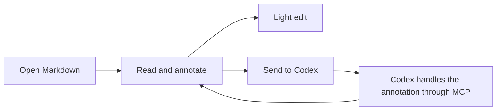

# Margent Quickstart

Welcome to Margent. This built-in example document helps you try the main reading, annotation, light editing, and Codex collaboration workflows.

## 1. Reading

Margent renders Markdown as a review-friendly reading surface. You can use the table of contents to jump between sections, then select text in the document to create annotations.

Try selecting this sentence, then add an annotation.

## 2. Annotations

Annotations are saved next to the Markdown file in a `.review.json` file. They do not change the Markdown content itself.

You can reply to an annotation, edit it, delete it, or mark it as resolved.

## 3. Mermaid

Margent supports Mermaid diagrams. This flowchart shows a typical local review loop.

## 4. Tables

Wide tables can scroll horizontally. You can also drag column edges to adjust column width.

| Scenario | What Margent does | Local file |
| --- | --- | --- |
| Read a document | Renders Markdown, Mermaid, code blocks, and tables | `.md` |
| Add annotations | Saves comments, replies, and status | `.review.json` |
| Connect Codex | Saves source and successor session information | `.codex.json` |

## 5. Light Editing

Use the edit button in the upper-right document controls to make lightweight Markdown changes. After saving, Margent tries to keep existing annotations attached to the matching text.

You can edit this paragraph as a quick test, then press `Ctrl+S` to save.

## 6. Codex Collaboration

If this document came from Codex, Margent can remember the source Codex session. You can also send annotations to Codex so Codex can read the annotation, reply to it, or update the Markdown when the requested change is clear.

You do not need to configure Codex for your first try. Opening this document, adding annotations, switching to edit mode, and saving changes all work locally.
