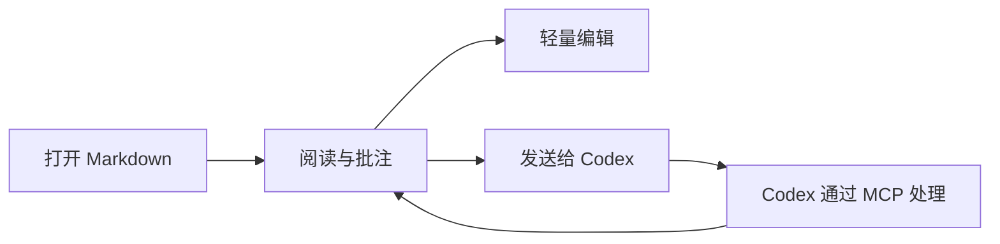

# Margent Quickstart

欢迎使用 Margent。这是一份内置示例文档，适合用来快速体验阅读、批注、轻编辑和 Codex 协作。

## 1. 阅读

Margent 会把 Markdown 渲染成适合审阅的阅读界面。你可以从左侧目录跳转章节，在正文里选择任意文本创建批注。

试着选中这句话，然后添加一条批注。

## 2. 批注

批注会保存在同目录的 `.review.json` 文件里，不会改动 Markdown 正文。你可以回复、编辑、删除批注，也可以把批注标记为已解决。

## 3. Mermaid

Margent 支持 Mermaid 图表渲染。下面这个流程图展示了一个典型的本地审阅闭环。

## 4. 表格

宽表可以横向滚动，也可以拖拽列宽。

| 场景 | Margent 行为 | 本地文件 |
| --- | --- | --- |
| 阅读文档 | 渲染 Markdown、Mermaid、代码块和表格 | `.md` |
| 添加批注 | 保存批注、回复和状态 | `.review.json` |
| 连接 Codex | 保存来源会话和接续会话信息 | `.codex.json` |

## 5. 轻编辑

点击文档右上角的编辑按钮，可以直接修改 Markdown 正文。保存后，Margent 会尽量让原有批注继续定位到对应文本。

你可以把这一段改成自己的测试内容，然后按 `Ctrl+S` 保存。

## 6. Codex 协作

如果这份文档来自 Codex，Margent 可以记录来源会话。你也可以把批注发送给 Codex，让 Codex 读取批注、回复批注，或按需要修改正文。

第一次体验时，不需要先配置 Codex。打开文档、添加批注、切换编辑态这些核心功能都可以直接使用。
