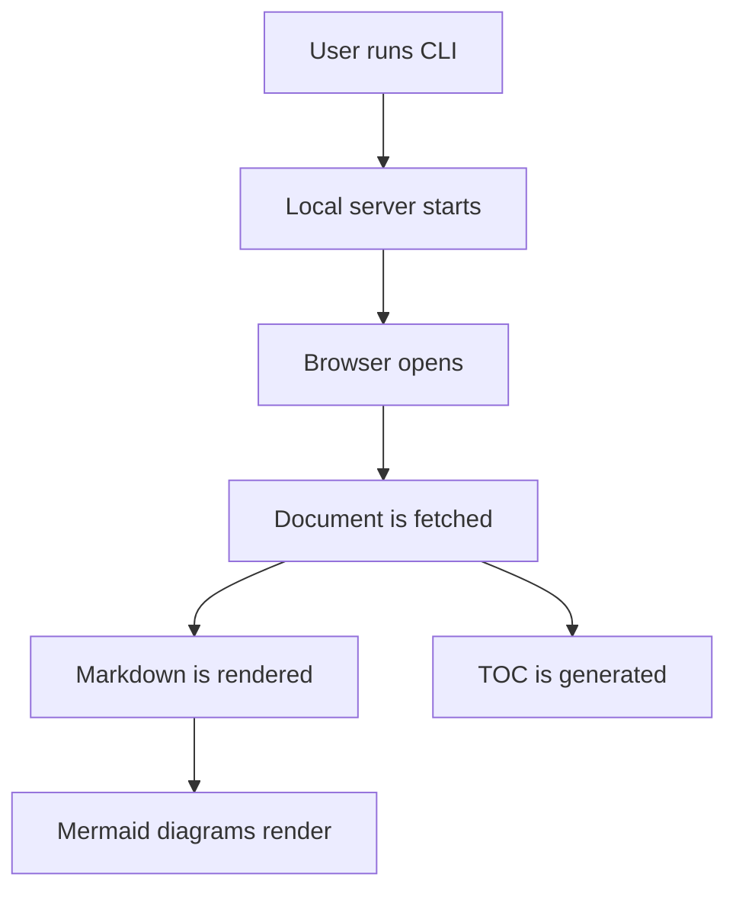
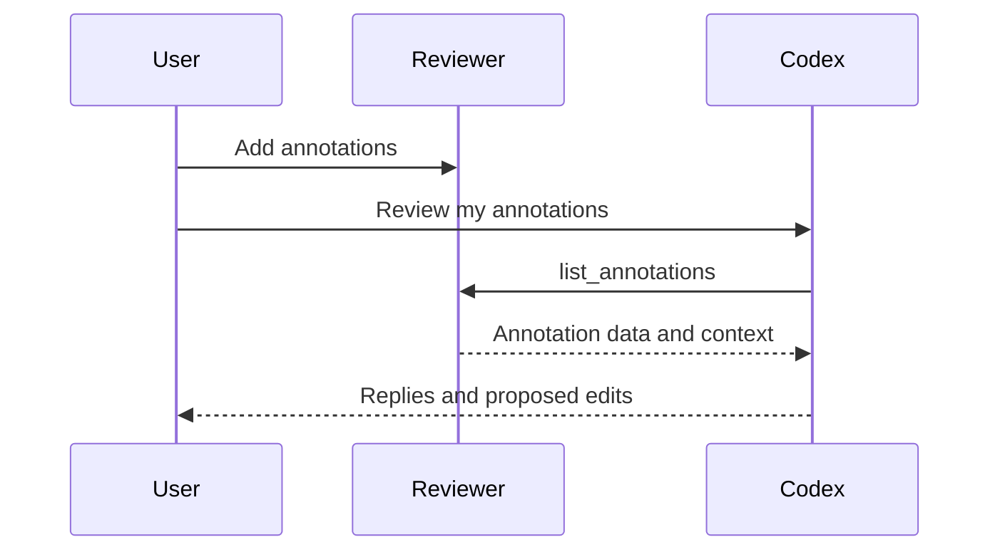

# AI Markdown Reviewer Sample Design

This sample document covers the reading features required in the first phase:
headings, prose, lists, tables, code blocks, and Mermaid diagrams.

## Background

AI tools often produce long Markdown documents. Markdown is easy to generate and
track in Git, but it is not always comfortable to review directly inside a text
editor.

The first phase focuses on a simple reading loop:

- open a local Markdown file
- render the document in a browser
- show a table of contents
- render Mermaid diagrams
- keep the original file untouched

> The reviewer should make long AI-generated documents easier to read before it
> adds annotation and agent workflows.

## Product Shape

The first version is a local web app started from the command line.

```bash
npx ai-md-reviewer ./docs/design.md
```

The page has a document outline on the left and the rendered document in the
main reading area.

### Feature Table

| Capability | Phase | Notes |
| --- | --- | --- |
| Markdown rendering | Phase 1 | Includes GFM tables |
| Mermaid rendering | Phase 1 | Flowcharts and sequence diagrams |
| Text annotations | Phase 2 | Saved in `.review.json` |
| MCP integration | Phase 4 | Agent reads annotations locally |

## Reading Flow



## Agent Flow Later

The first phase does not implement annotations, but the document data already
returns a future review path.



## Parser Notes

The heading parser should ignore Markdown headings inside fenced code blocks.

```md
# This is code, not a document heading

## This should not appear in the table of contents
```

### Duplicate Headings

Duplicate headings should produce stable, unique ids.

### Duplicate Headings

This second heading has the same text as the previous one.

## Completion Criteria

1. The CLI starts the local app.
2. The browser opens a rendered reading page.
3. The table of contents can jump to sections.
4. Mermaid diagrams render as diagrams.
5. Refreshing the page reloads the same document.
