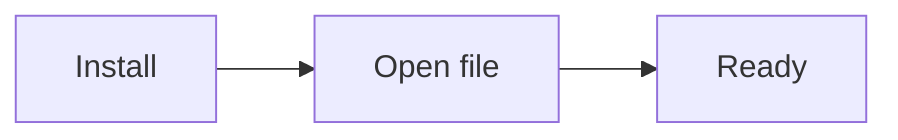

# Margent Release Smoke

这份文档用于打包安装后的桌面 smoke test。

## 打开验证

- 文件名包含空格和中文路径时也应该能被 Margent 打开。
- 安装后的 App 应该能通过 `open -a /Applications/Margent.app <fixture.md>` 拉起。

```mermaid
flowchart LR
  A[Install] --> B[Open file]
  B --> C[Ready]
```
